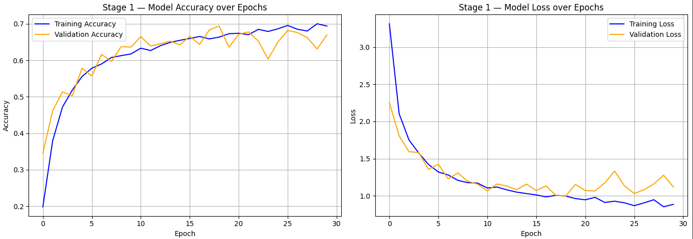
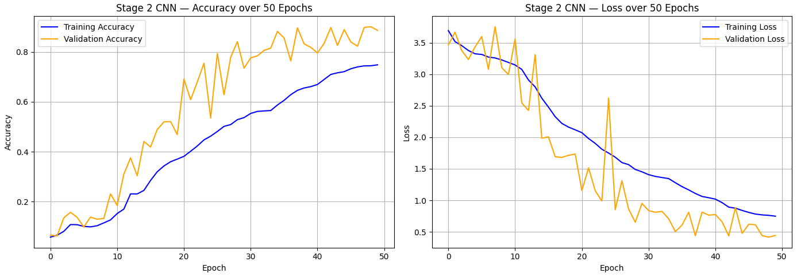
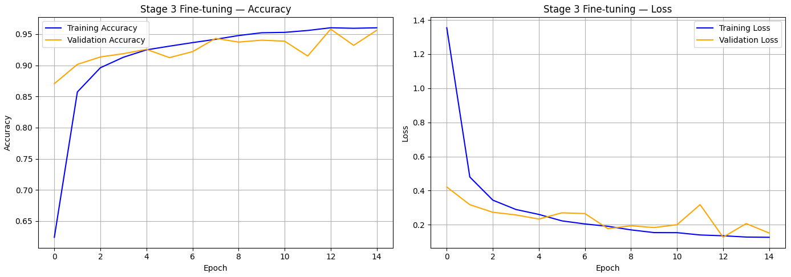

# 🌿 Plant Disease Detection System

A progressive plant disease detection pipeline built on the **PlantVillage dataset** (54,305 images, 38 classes), evolving through three stages from a baseline dense network to a fine-tuned MobileNetV2 Transfer Learning model achieving **95.81% validation accuracy**.

---

## 📊 Results Summary

| Stage | Architecture | Validation Accuracy |
|---|---|---|
| Stage 1 | Dense Neural Network (baseline) | 68% |
| Stage 2 | Custom CNN with BatchNorm & Dropout | 90% |
| Stage 3 | MobileNetV2 Transfer Learning + Fine-tuning | **95.81%** |

> Stage 4 — YOLO-based disease localization with bounding boxes — is currently in progress.

---

## 📁 Dataset

- **Name:** [PlantVillage Dataset](https://www.kaggle.com/datasets/abdallahalidev/plantvillage-dataset)
- **Total images:** 54,305
- **Classes:** 38 (plant + disease combinations)
- **Plants covered:** Tomato, Potato, Apple, Grape, Corn, Peach, Pepper, Strawberry, and more
- **Notable challenge:** Significant class imbalance — ranging from 152 images (Potato healthy) to 5,507 images (Orange Haunglongbing)

---

## 🏗️ Project Architecture

### Stage 1 — Dense Neural Network (Baseline)
- **Goal:** Establish a working end-to-end pipeline
- **Architecture:** Flatten → Dense(256, ReLU) → Dense(128, ReLU) → Dense(38, Softmax)
- **Key decisions:**
  - Image size: 128×128 RGB
  - Batch size: 32 (data generator to avoid RAM overflow)
  - Class weights to handle imbalance
  - Adam optimizer, Categorical Crossentropy
  - 30 epochs
- **Result:** 68% validation accuracy
- **Limitation:** 12.6M parameters, 2.5 hours training on CPU, no spatial understanding



---

### Stage 2 — Custom CNN
- **Goal:** Improve accuracy using convolutional layers for spatial feature extraction
- **Architecture:**
  - Conv2D(32) → BatchNorm → ReLU → MaxPool
  - Conv2D(64) → BatchNorm → ReLU → MaxPool
  - Conv2D(128) → BatchNorm → ReLU → MaxPool
  - Flatten → Dropout(0.25) → Dense(256) → Dropout(0.5) → Dense(38, Softmax)
- **Key decisions:**
  - 3 conv blocks with 32→64→128 filter progression
  - BatchNormalization to fix training instability seen in Stage 1
  - Dropout 0.25 then 0.5 for regularization
  - GPU training (T4) — reduced training time to ~35 minutes
- **Result:** 90% validation accuracy
- **Improvement:** +22 percentage points over Stage 1, fewer parameters (8.4M)



---

### Stage 3 — Transfer Learning with MobileNetV2
- **Goal:** Leverage pretrained ImageNet knowledge for higher accuracy
- **Base model:** MobileNetV2 (pretrained on ImageNet, 1.2M images)
- **Architecture:**
  - Data Augmentation (horizontal flip, rotation, zoom)
  - MobileNetV2 base (frozen in Phase 1)
  - GlobalAveragePooling2D
  - Dropout(0.2) → Dense(128, ReLU) → Dropout(0.4) → Dense(38, Softmax)
- **Training approach:**
  - Phase 1 (20 epochs): Base frozen, only top layers trained — reached 90.76%
  - Phase 2 Fine-tuning (15 epochs): Last 20 MobileNetV2 layers unfrozen, learning rate reduced to 0.0001 — reached **95.81%**
- **Key decisions:**
  - training=False on base model to preserve BatchNorm statistics
  - Conservative unfreezing (last 20 of 154 layers) to prevent overfitting
  - Only 168K trainable parameters in Phase 1 (7% of total)
- **Result:** 95.81% validation accuracy



---

## ⚙️ Technical Stack

- **Language:** Python
- **Deep Learning:** TensorFlow, Keras
- **Data Processing:** NumPy, OpenCV
- **Visualization:** Matplotlib
- **Platform:** Google Colab (T4 GPU)
- **Dataset source:** Kaggle (PlantVillage)

---

## 🧠 Key Engineering Decisions

| Decision | Choice | Reason |
|---|---|---|
| Image size | 128×128 | Balance between detail and memory |
| Color | RGB | Color is critical for disease identification |
| Data loading | Generator + batch size 32 | Avoids RAM overflow on 54K images |
| Class imbalance | Class weights | Preserves all data unlike undersampling |
| Train/test split | 80/20 stratified | Proportional class representation in both sets |
| Fine-tuning LR | 0.0001 | 10x lower to avoid destroying pretrained features |
| Layers unfrozen | Last 20 of 154 | Conservative — early layers detect universal features |

---

## 📂 Repository Structure

```
Plant-Disease-Detection/
│
├── Plant_Disease_Detection.ipynb   # Full project notebook
├── README.md                       # This file
└── plots/
    ├── stage1_results.png          # Stage 1 training curves
    ├── stage2_results.png          # Stage 2 training curves
    └── stage3_results.png          # Stage 3 training curves
```

> Model files (.h5) are not included due to size. Available on request.

---

## 🚀 How to Run

1. Open `Plant_Disease_Detection.ipynb` in Google Colab
2. Enable GPU: Runtime → Change runtime type → T4 GPU
3. Run all cells in order
4. The dataset will be downloaded automatically from Kaggle (requires Kaggle API token)

---

## 📈 Future Work

- **Stage 4:** YOLO-based object detection to localize disease regions with bounding boxes
- Streamlit web interface for real-world deployment
- Mobile-optimized model for field use by farmers

---

## 👤 Author

**Hadi Mourad** — CS Graduate, Lebanese International University  
[LinkedIn](https://www.linkedin.com/in/hadi-mrad-a7884236a) | [GitHub](https://github.com/Hadi-M005)
